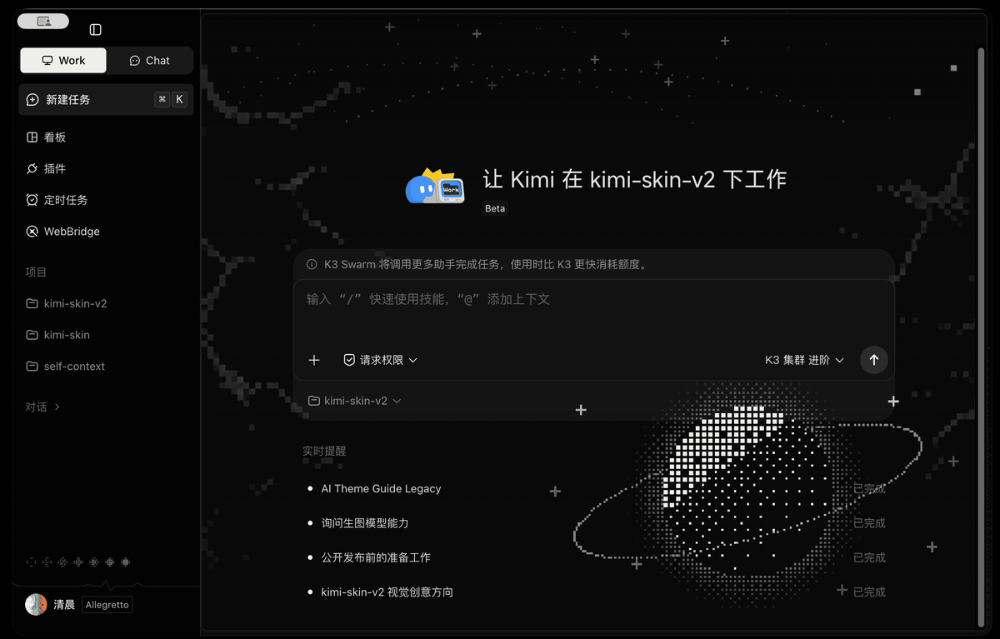
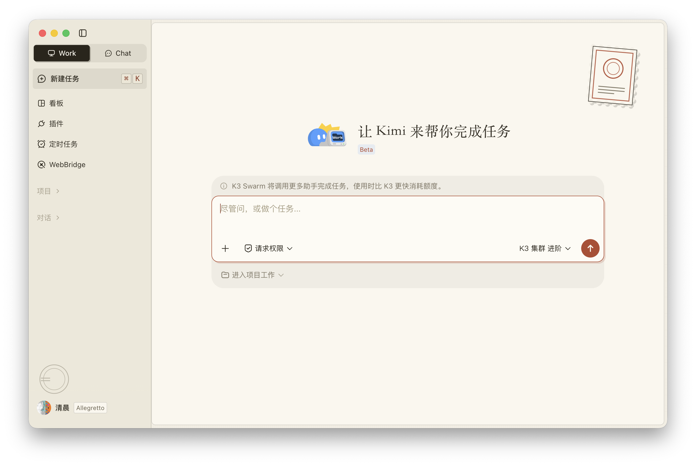
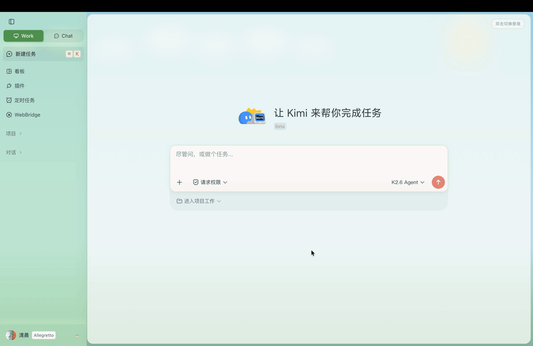
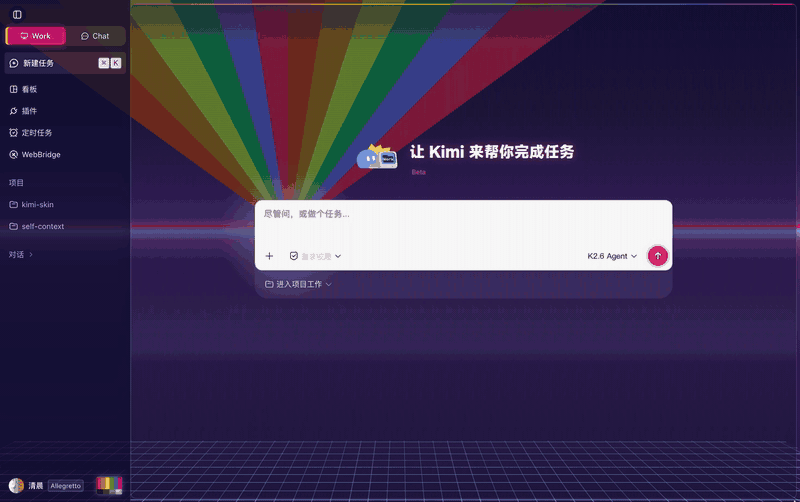

# kimi-skin


为 Kimi macOS 桌面端提供可恢复、低侵入的自定义主题能力。想换风格不必手写 CSS——下载 [kimi-skin-theme 技能](./skills/kimi-skin-theme/SKILL.md) 交给 Kimi，让它帮你创作和调试自己的主题。

kimi-skin 通过本机 Chrome DevTools Protocol 向 Kimi Work Renderer 注入受限 CSS，不修改 Kimi.app、不解包 `app.asar`，恢复后会关闭调试会话并以普通方式启动 Kimi。


## 下载与使用

普通用户从 Releases 下载 `kimi-skin-<version>-macos.zip` 并解压，直接使用下面三个双击入口，不需要在终端输入 `kimi-skin`：

- `macos/Apply Theme.command` → `kimi-skin apply`：检查环境、选择并应用主题；已有主题会话时直接热切换
- `macos/Check Status.command` → `kimi-skin status`：查看 Kimi、主题和 Watcher 状态
- `macos/Restore Kimi.command` → `kimi-skin restore`：移除主题并恢复普通 Kimi

`.command` 是对应 CLI 命令的双击包装，复用 Kimi 自带的签名 Node 运行时，不要求普通用户安装 Node.js 或注册全局命令。首次从普通模式启用主题需要重启 Kimi；之后再次运行应用入口会直接热切换，无需先恢复。

仓库当前包含四个主题：

- **Dark Side · 月之暗面**：黑白半调点阵、月相序列和 ECG 心跳线


- **Paper · 纸间**：手工排印的纸质杂志，米白纸底、衬线标题、活版卡片硬阴影


- **哞哞牧场 · MooMoo Meadow**：蓝天白云下的绿色牧场，双击首页切换昼夜，含飘动云朵、萤火虫和眨眼奶牛



- **CRT**：复古未来专辑封面——消失点放射彩虹光束、霓虹地平线、透视网格地板，主页整体 CRT 屏幕质感



也支持自定义主题：下载 `skills/kimi-skin-theme/` 技能，让 AI Agent 帮你完成主题创作与调试。首次使用时 Kimi 会把该技能同步到官方 skill 目录（`~/Library/Application Support/kimi-desktop/daimon-share/daimon/skills/`），之后每次在仓库中工作都会通过 `scripts/sync-skill.sh` 自动再同步，保证 Kimi 加载的始终是仓库里的最新版本。

## 从源码运行与开发

要求 Node.js 22+ 和 pnpm：

```bash
pnpm install
pnpm check
pnpm test
pnpm build
pnpm release:pack
```

`release:pack` 会先完成检查、测试和干净构建，再生成可直接分发的 macOS zip。

下面的 `kimi-skin ...` 命令面向源码开发和调试。首次使用前注册一次全局命令：

```bash
npm link
```

开发命令：

```bash
kimi-skin doctor                              # 检查环境
kimi-skin themes                              # 查看已有主题
kimi-skin apply                               # 交互选择主题
kimi-skin apply --theme ./themes/dark-side    # 直接指定主题
kimi-skin switch --theme ./themes/paper       # 不重启热切换主题
kimi-skin reload                              # 立即重新注入
kimi-skin status                              # 查看状态
kimi-skin compat bump                         # Kimi 升级后继承上一版表面清单
kimi-skin restore                             # 恢复普通 Kimi
```

`apply` 会自动识别当前状态：普通模式下会在重启 Kimi 前请求确认，已激活主题模式时直接热切换。主题目录中的 CSS、清单或素材变化后，Watcher 会自动热重载。`switch` 也可以显式热切换主题，切换失败会自动回滚到原主题。

## 主题

每个可运行主题位于 `themes/<theme-id>/`：

```text
theme.json
theme.css
assets/        # 可选，本地图片素材
```

主题素材、字体、交互能力和 CSS 接口统一记录在 [themes/README.md](./themes/README.md)。主题不能加载远程资源、`@import` 或任意 JavaScript；声明 `safe-css` 能力后，加载时会执行白名单契约。

```bash
kimi-skin validate --theme ./themes/<theme-id>
kimi-skin check-theme --theme ./themes/<theme-id>
kimi-skin probe
```

仓库内的 `skills/kimi-skin-theme/` 用于让 AI Agent 创建和修改主题，是 skill 的事实源；官方 skill 目录中的副本由 `scripts/sync-skill.sh` 单向同步生成，不要直接编辑。具体工作流以 [SKILL.md](./skills/kimi-skin-theme/SKILL.md) 为准。

## 边界

- 不修改 Kimi.app、代码签名、更新机制、登录状态或用户内容
- 不读取、保存或上传聊天内容、Cookie、凭证和 API Key
- 调试端口只绑定本机回环地址
- Kimi 版本不兼容或关键状态无法验证时停止应用
- 暂不支持 Chat 网页、Windows、自动主题切换和图形化主题管理器

完整威胁模型与漏洞报告方式见 [SECURITY.md](./SECURITY.md)。

## License

[MIT](./LICENSE) © kimi-skin contributors
